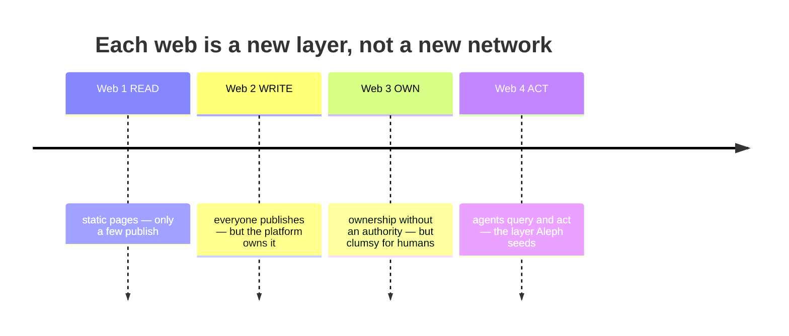
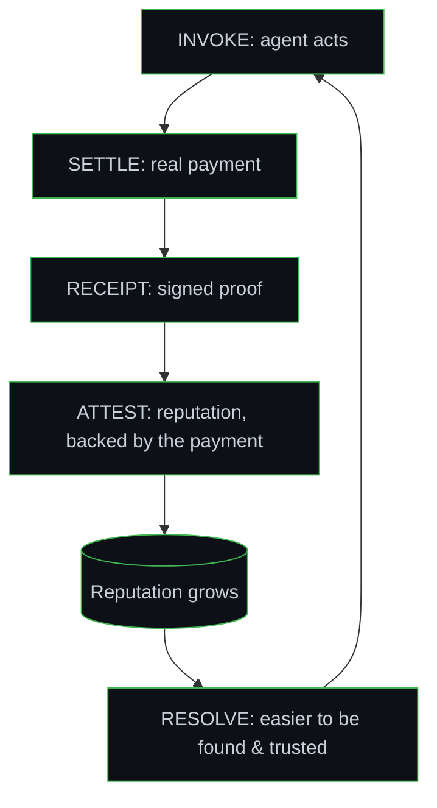

# Aleph Protocol

> **A thin-waist protocol for an agent-native web** — how machines **find, trust, act, pay, and prove**, without a human in the loop and without a central authority gatekeeping any of them.

**Status:** Working draft · foundational documents **+ a running reference implementation** in [`code/`](code/) where **all five verbs work end to end**, with 27 tests (`cd code && node src/demo/run.ts`). Includes settlement (PAY), settlement-backed reputation (TRUST, anti-Sybil), receipt chaining (PROVE), agentic composition, a hardened waist, `did:web`, registry federation, a CLI, and native agent use over MCP.
*Aleph is a working codename — the name is an evolvable layer, not part of the protocol's frozen core, so it may change. (An unrelated project, Aleph.im, uses the name in the storage space.)*

---

## The one-paragraph version

The internet and the web were built for **humans**: documents to read with eyes, buttons to press with hands. Software **agents** — programs that act on a person's behalf — are blind and mute in them. They can *read* the web but cannot reliably **find** an unknown service, **trust** it, **act** on it within bounds, **pay** it at machine speed, or **prove** what they did. Those five missing verbs are the gap between an agent that narrates and an agent that does. Aleph defines the minimum layer that restores all five — built, like every network before it, **not by laying new cables but by adding a thin new protocol on top of the ones that already exist.**


---

## Read in this order

| # | File | What it is | For |
|---|---|---|---|
| 1 | [`foundations.md`](foundations.md) | **Start here.** From the telegraph (1840s) to ARPANET (1969) to the web eras — what a network *is*, how the first ones were made, the lessons, and the web we want to remake. With diagrams. | Anyone. No prior knowledge needed. |
| 2 | [`aleph-protocol-paper.md`](aleph-protocol-paper.md) | The foundational paper — problem, design principles, the five verbs in depth, the trust loop, open problems, relationship to MCP/A2A/DID/web3, build order. *The why.* | Understanding the design. |
| 3 | [`aleph-manifest-spec.md`](aleph-manifest-spec.md) | The normative wire spec — the Envelope, Manifest, Grant, and five message types, field by field (RFC-2119). *The how.* | Implementers. |

---

## The idea, in pictures

**A network is a protocol, not infrastructure.** Every "new web" is a new layer on the one below — we are not the cables, we are the language:



**The narrow waist (the hourglass).** What everyone must adopt is made as *small* as possible; all richness lives in optional layers above and free transport below:

```
   OPTIONAL LAYERS   discovery · reputation · settlement · grants · IoT · DAO
   ════ THIN WAIST   DID + Manifest + signed Envelope (5 types) ════
   TRANSPORT         HTTP · P2P · queues — anything
```

**The self-sustaining trust loop.** Every interaction leaves a signed proof; proofs become reputation; and because trust is minted by *real payment*, it is expensive to forge:



The five verbs map to five `Envelope` types:

| Verb | Type | Function |
|---|---|---|
| FIND | `RESOLVE` | ask a registry "who does X?" → pointers to Manifests |
| ACT | `INVOKE` | execute a capability, carrying a bounded **Grant** (delegation) |
| PROVE | `RECEIPT` | a signed, chained record of what happened |
| TRUST | `ATTEST` | a signed reputation fact — valid only if it references a settlement (anti-Sybil) |
| PAY | `SETTLE` | release of value, ideally atomic with delivery |

---

## Design stance

- **Thin waist (hourglass).** Make universal as *few* things as possible. The smaller the core, the less can be wrong, and the smaller the blast radius of any mistake.
- **Pull, not push.** Deliver capability, data, trust, and proof at the moment of need — never eagerly ahead of time. The source of the order-of-magnitude efficiency (and the real prize: autonomy).
- **Minimal and evolvable, not perfect.** No protocol ever launched perfect (IP is best-effort *on purpose*; TCP/IP was retrofitted onto a live ARPANET; the governance docs are literally *Requests for Comments*). Care is concentrated on the tiny, near-frozen waist; everything else evolves via `version` and `ext`.
- **Wrap, don't replace.** An existing MCP server becomes an Aleph node by gaining a DID, a Manifest, and the ability to emit a `RECEIPT`. MCP is the `INVOKE` payload, not a competitor.

## Honestly open problems

Declared, not hidden (full premortem in the paper, §8):

1. **Sybil / reputation** — settlement-backed trust raises the cost of forgery but does not zero it. The hardest problem; the most valuable to attack.
2. **The oracle / fiat boundary** — the chain proves what happens inside it, not that off-chain facts are true.
3. **Two-sided bootstrap** — be your own first guaranteed customer.
4. **Vocabulary governance** — the shared capability keys are governed forever; the price of the standard.

## Build order (the "1969 move")

1. **Manifest + a thin registry + receipts** — a node declares itself, an agent finds and calls it, the interaction leaves a signed proof.
2. **The "LO" of 1969** — one agent reads a Manifest, calls a node, gets a signed `RECEIPT`. Two nodes speaking the new language = the four-node network, alive and real.
3. **Discover, don't pre-design** — the killer app (like email on ARPANET) is visible only after the network is switched on.

The **registry** is the multiplier of everything else and therefore the first concrete deliverable.

---

## Status & contributing

The foundational documents are complete, and a **running reference implementation** lives in [`code/`](code/) with **all five verbs working end to end** (27 tests): identity (`did:key`/`did:web`), signed envelopes with a hardened waist (replay/skew/version), bounded grants, typed schema validation, escrow settlement (atomic release / refund-on-failure), settlement-backed attestations (anti-Sybil) with consumer-computed trust, reputation-ranked discovery, receipt chaining, agentic composition across nodes, registry federation, a capability vocabulary, a CLI, and native agent use over MCP.

The honestly-open frontier (see the paper, §8): a real on-chain settlement/payment rail to replace the in-memory one, the fiat/oracle reserve boundary, and persistent/federated registries at scale. It is deliberately imperfect and expected to change: **when reality contradicts a page, the page changes.** Issues, critiques, and precise attacks are worth more than agreement — a convergent objection from an opposite premise is how this gets stronger.

*License: TBD. Lineage: the agentic-web direction is developed in dialogue with the Operative Ecosystem (ESO) corpus.*
