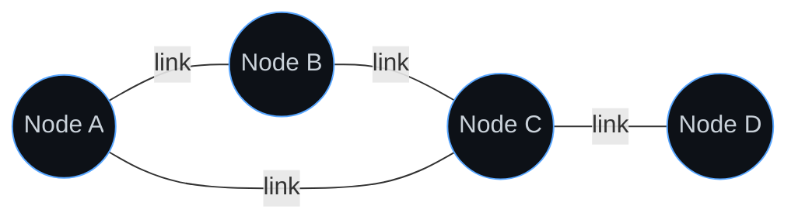
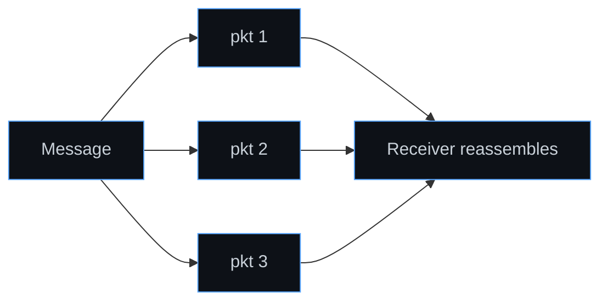
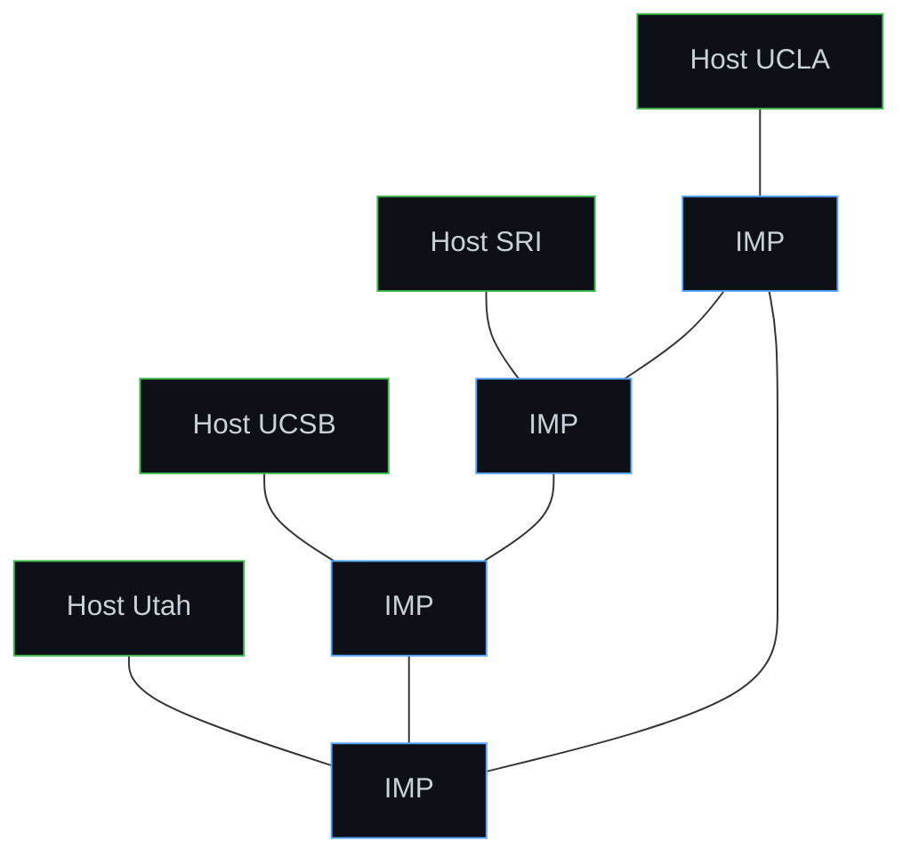
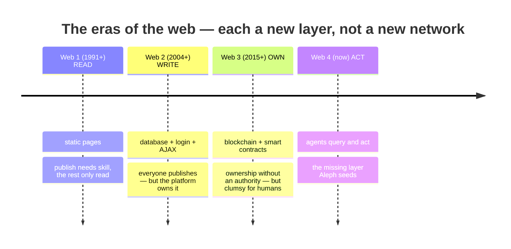
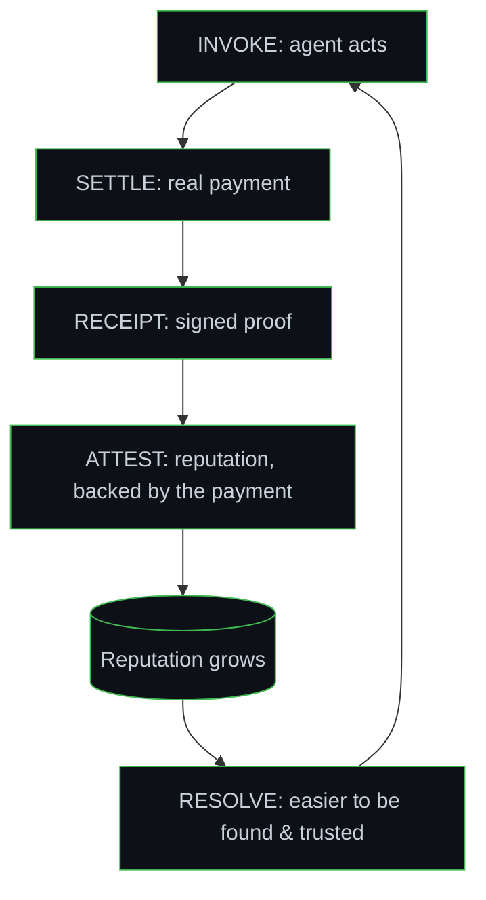

# Foundations — From the Telegraph to Agents

### Why we are building Aleph, starting from the very base: what a network is, how the first ones were made, and what we want to remake

> This document assumes nothing. It begins at "what is a network?" and walks, in order, through every network humanity has built — telegraph, telephone, ARPANET, the Internet, the Web and its eras — extracting at each step the one lesson that tells us *how* networks are actually created. It ends at the network that does not exist yet, and that Aleph is designed to seed: the **agent-native web**.

---

## 1. What a network actually is

Strip a network to the bone and it is three things — and only three:

1. **Nodes** — the things that participate (computers, people, companies, telephone exchanges… anything).
2. **Links** — the channels between them (a cable, a radio wave, a relationship).
3. **A protocol** — the *shared language*: the agreed rules for how two nodes talk, find each other, and understand one another.



The point almost everyone misses: **the first two are hardware; the third is the network.** Two computers joined by a cable are not a network — they are two computers and a cable. They *become* a network the instant they share rules for how to speak. This is why every "new network" in history did **not** re-lay the cables — it added a new *protocol* on top of cables that already existed. Hold onto this; it is the master key.

There is also an economic law of networks — **Metcalfe's law**: a network's value grows roughly with the **square of the number of nodes**, because each new node adds possible connections to all the others. This is why networks start almost worthless and then explode: below a critical mass they are nothing; above it they are unstoppable. It explains both why the agent web is "invisible" today and why whoever places the nodes early wins.

---

## 2. The networks of the 1800s and 1900s: telegraph and telephone

The first electrical network was the **telegraph** (1840s): nodes = telegraph offices, links = copper wires, protocol = **Morse code**. Already here the network is the *language*, not the wire: Morse is a full protocol — a shared convention for encoding information onto a channel.

Then the **telephone** (from 1876), which introduced the model that ruled for a century: **circuit switching**. When you call someone, the network builds a dedicated physical circuit between you and them — at first literally an operator plugging in jacks — and that circuit is yours, reserved, for the entire call, even during silence.

```mermaid
graph LR
    subgraph Circuit switching (telephone)
    Y[You] === EX1[Exchange] === EX2[Exchange] === T[Them]
    end
    classDef n fill:#0d1117,stroke:#f0883e,color:#c9d1d9;
    class Y,EX1,EX2,T n;
```

It works, but it has two structural flaws — and these two flaws are exactly what the first computer network was born to fix:

- **It wastes.** The circuit is 100% occupied even when you transmit 5% of the time.
- **It is fragile.** The circuit is a single path; cut any point and the call dies.

---

## 3. The idea that changed everything: packet switching

In the 1960s, three people in three places arrive independently at the same idea (a textbook case of "an idea matured in the system"):

- **Paul Baran** (RAND, USA, ~1964) asks how to build a communication network that survives a nuclear strike. Answer: no center, no dedicated circuits — a **distributed** mesh where messages find their own alternate paths.
- **Donald Davies** (NPL, UK) reaches the same architecture for pure efficiency, and coins the name: **packet switching**.
- **Leonard Kleinrock** (MIT, then UCLA) builds the mathematical theory.

The idea, simply:

> Instead of building a dedicated circuit per conversation, **break every message into small, independent packets**. Each packet carries the destination address and travels on its own, hopping node to node; each node looks at it and forwards it onward. Packets may take different routes, arrive out of order — the receiver reorders them and rebuilds the message.



Both telephone flaws vanish at once: one cable now carries packets from a thousand interleaved conversations (no waste), and if a node dies the packets route around the hole (no fragility). In exchange you give up the guarantee: the network does not promise delivery, order, or timing — it does its **best effort**. That surrender turns out to be genius, not a compromise (see §5).

A fourth father deserves naming: **J.C.R. Licklider**, who in 1962, as a director at ARPA, wrote visionary memos about an "Intergalactic Computer Network" — and, crucially, put the money and the right people in one room. Networks always need a patron with a mission.

---

## 4. The first network: ARPANET, 1969

**The concrete problem.** ARPA funded dozens of universities, each with an expensive, mutually-incompatible computer. To use another institute's machine you had to physically go there. ARPANET's goal was prosaic: **share expensive computing resources.** (Note: *not* "connect humanity" — great networks always start from a small, concrete problem.)

**The key architectural move: the IMP.** Computers of the era were all different (hardware, OS, encodings). Connecting them directly would mean writing an adapter for every pair — combinatorially impossible. The solution (Wes Clark): **don't connect the computers to each other.** Put a small, *identical-for-everyone* dedicated computer in front of each one — the **IMP** (Interface Message Processor, a 400 kg fridge built by BBN) — which speaks the network's language on one side (to other IMPs) and the local computer's language on the other. The real network is the network of IMPs; each institute only has to learn to talk to *its own* IMP.



This is the first great design lesson: **a network scales only if you separate the layers** — transport (the IMPs) from applications (the host computers). It is the direct ancestor of today's "layered stack," and it returns identically in every later network.

**The first message.** 29 October 1969, 22:30: Kleinrock's lab at UCLA tries to connect to the Stanford Research Institute, 500 km north. Charley Kline types "LOGIN", letter by letter, a colleague confirming by phone. The "L" arrives, the "O"… and SRI's system crashes. **The first message ever sent on the internet's ancestor was "LO".** They retry an hour later; it works.

By December 1969 the network has **4 nodes**: UCLA, SRI, UC Santa Barbara, Utah. Four. This was the network everything descends from — and for years it was an obscure object most of the world ignored.

**The protocol and the killer app.** Above the IMPs they needed a host-to-host language: **NCP**, written largely by students — the Network Working Group — who documented decisions in circular notes called **RFCs, "Request for Comments"**: a deliberately humble name. That format — open proposals, commentable by anyone, adopted by consensus and merit — is how the internet is governed *to this day*. Open governance was not a detail: it was *why* the network could grow without an owner.

Then the surprise: in 1971 **Ray Tomlinson** invents, almost as a joke, email between different machines (he picks the **@**). Within two years email is the *majority* of ARPANET traffic. The network built to share compute is used by people to *talk*. Second great lesson: **a network's killer app is never the one it was designed for** — and you discover it only by switching the network on.

---

## 5. From ARPANET to Internet: the network of networks

By the 1970s, packet networks multiplied: ARPANET, radio nets, satellite nets, the first local nets (Ethernet, 1973). All mutually incompatible. The problem reappears one level up: how do you connect *the networks*?

The answer is the 1974 paper by **Vint Cerf and Bob Kahn**, from which **TCP/IP** is born — and here is the deepest idea in the whole story:

- **IP** is the minimal common protocol: it defines only addresses and the packet format. It promises nothing — best effort.
- **TCP** lives *only at the ends* (in the sending and receiving computers) and handles reliability *there*: reordering, retransmitting what was lost.
- The network in the middle stays **deliberately stupid.**

This is the **end-to-end principle**: keep the intelligence at the edges, keep the center minimal and neutral. It looks like a technical detail; it is the most important political decision of the digital 20th century. A "stupid" center **does not have to ask anyone's permission to host a new application**: the web, video streaming, voice calls — none of them needed to change the network or convince an operator. Had the network been "smart" and proprietary (as the phone companies wanted), every innovation would have required the owner's approval.

This gives the shape that governs everything — the **hourglass (the narrow waist)**:

```
   \   infinite rich applications   /     <- richness (web, mail, video, agents)
    \  (everyone does as they like) /
     \                            /
      ====  IP — the thin waist  ====      <- the universal standard: MINIMAL
     /                            \
    /   infinite physical links    \       <- richness (fibre, radio, satellite)
   /  (everyone does as they like)   \
```

The narrow point — **IP** — is what *everyone* adopts, and it is deliberately tiny. All the richness lives *above* and *below*, where universal agreement is **not** needed. This is the single most important design principle we inherit, and Aleph obeys it directly (see §8).

On 1 January 1983 — the "flag day" — ARPANET switches off NCP and switches on TCP/IP. That date is the technical birth of the **Internet**: not a network, but *the inter-connection of all networks* through one common protocol. The same year brings **DNS** (Paul Mockapetris): the system that translates human-readable names into numeric addresses — the network's phone book. Remember DNS; it returns at the end.

---

## 6. The Web and its eras

In 1989, **Tim Berners-Lee** at CERN has a concrete problem (again, small and concrete): physicists lose information because documentation lives on incompatible systems. His solution is three deliberately simple pieces — **URL** (a universal address for a *document*), **HTTP** (a minimal protocol to request it), **HTML** (a format to write it, with **links** to other documents anywhere). Note what he did *not* do: **he laid not one metre of cable.** The Web is entirely a *logical layer on top of the Internet* — three conventions and a first server.

And so the eras:



- **Web 1 — read.** Static pages, one-way. A tiny minority publishes (HTML + a server); everyone else only consults.
- **Web 2 — write.** The page stops being a file: a *program* builds it on the fly from a **database**, you have a **login**, **AJAX** makes it feel like an app. Everyone can now publish: Wikipedia, YouTube, Facebook. But to give billions of people profiles and feeds, you needed huge data centers — so a few companies owned everything. **Web 2 democratized publishing and centralized ownership.** You write the posts; they sit on Meta's servers. *You are the product, not the owner.*
- **Web 3 — own.** **Satoshi Nakamoto** (2008) solves keeping a shared ledger no one controls (the double-spending problem) with the **blockchain**: a public ledger replicated by thousands, blocks chained immutably, consensus bought with energy (proof of work). **Vitalik Buterin** (2015) generalizes it with **Ethereum** and the **smart contract** — a program that runs on the chain, that no one can stop or alter. For the first time a digital object can be *scarce and owned* without an authority. But Web 3 broke most of its promise: slow, expensive, terrible UX, re-centralized in practice, dominated by speculation. **It failed for humans — not because the idea was wrong, but because the right user was missing.**

---

## 7. The pattern across all of it

Line up every network and the lessons are unanimous:

1. **A network is a protocol, not an infrastructure.** The Web has no cables of its own. Email was a layer on ARPANET; the Web a layer on TCP/IP; social a layer on the Web. **Every "new network" is a new protocol on top of the previous one.**
2. **First networks are tiny.** ARPANET: 4 nodes. The Web: 1 site for a year. None started big — they started with the *right first nodes* and grew by merit.
3. **They start from a concrete problem, never from the vision.** Share expensive computers; don't lose CERN's docs. The grand vision is written *afterwards*, by the winners.
4. **The killer app is discovered by switching it on** (no one planned email).
5. **Stupid center, smart edges.** The neutral, permissionless network beats the smart, proprietary one (the telcos and walled gardens lost).
6. **At each generation, enormous value concentrates at one precise point: the *discovery layer*.** Phone book → Yellow Pages. Internet → DNS. Web → Google. Once the nodes are many, the dominant problem stops being "communicate" and becomes **"find"** — and whoever owns the layer that solves *finding* captures more value than whoever owns the nodes.

---

## 8. What we want to remake: the agent-native web

Look at the *problem* each web solved, and where the chain stops:

| Era | Problem solved | What it left open |
|---|---|---|
| Web 1 | How do I find & read information? | — |
| Web 2 | How do I let everyone participate? | …but the platform owns it |
| Web 3 | How do I remove the owner? | …but it's clumsy for humans |
| **Web 4** | **How do agents find, trust, act, pay, prove?** | *the layer that does not exist yet* |

Here is the hinge. Web 3 "failed" for humans not because the idea was wrong, but because **the right user was missing.** Verifiable ownership, self-executing contracts, an immutable public record — *terrible* to handle by hand, but **ideal for machines** that must trust one another, pay one another, and prove what they did without an intermediary. The actor that makes Web 3 finally make sense is the **AI agent** — which has only now matured.

But agents are **blind and mute** in a web built for human eyes and hands. To act for you, an agent today must hand-integrate, be told an API exists, or scrape a human page and guess. Underneath sit **five missing verbs**:


**Aleph** is the protocol that gives an agent these five verbs — *without a human in the loop and without a central owner of any of them*. It does not build a new network: the transport (internet) and the action format (MCP) already exist. It adds the **thin new layer** that is missing, obeying every lesson above:

- **A protocol, not infrastructure** (lesson 1): Aleph is one signed, addressed **Envelope** between two cryptographic identities, carrying one of five message types. We are not the cables; we are the *language*.
- **The narrow waist** (the hourglass, §5): what everyone must adopt is made as small as possible — DID + Manifest + Envelope. All richness (discovery, reputation, payment, IoT) lives in *optional layers above*.
- **Start tiny, from a concrete problem** (lessons 2–3): the bootstrap problem is the wasted compute and wasted tokens of running agents — a real, measurable pain with a guaranteed first customer (you). The minimal viable network is *one agent that reads a Manifest, calls a node, and gets a signed receipt* — the "LO" of 1969.
- **The discovery layer is the prize** (lesson 6): the "DNS / Google of agents" — the registry where an agent finds an unknown node and knows whom to trust — does not exist yet. That, plus the bounded permission that lets an agent act safely, is the open position Aleph occupies.

The trust loop is what makes it self-sustaining — exactly the spiral that turns a circle into an ascent:



Every interaction leaves a signed trace; the trace becomes the trust that makes the next interaction cheaper; and because trust is *minted by real payment*, it is expensive to forge. The more the network is used, the more trustworthy it becomes, the more it is used.

---

## Where to go next

- **The full vision and architecture:** [`aleph-protocol-paper.md`](aleph-protocol-paper.md) — problem, design principles, the five verbs in depth, the trust loop, open problems, relationship to MCP/A2A/DID/web3, build order.
- **The exact wire format:** [`aleph-manifest-spec.md`](aleph-manifest-spec.md) — the Envelope, the Manifest, the Grant, the five message types, field by field (RFC-2119).

> No network in history launched perfect. IP is best-effort *on purpose*; ARPANET's first message crashed mid-word; TCP/IP was retrofitted onto a live network; the governance docs are literally *Requests for Comments*. Aleph does not aim to be perfect. It aims to be **minimal and evolvable** — small enough that little can be wrong, versioned so what is wrong can be fixed without breaking the network. When reality contradicts a page, the page changes.
